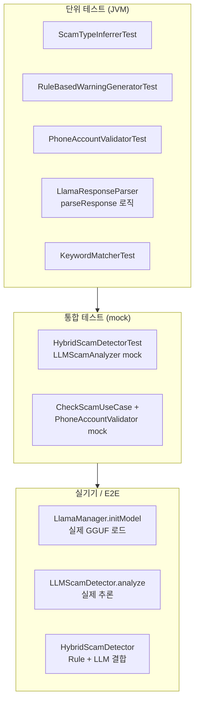

# OnGuard 테스트 가이드

## 📱 실제 디바이스 테스트 절차

### 1단계: 앱 설치 후 권한 설정

#### 1.1 접근성 서비스 활성화
1. **설정** → **접근성** → **설치된 서비스**
2. **OnGuard** 선택
3. **서비스 사용** 토글 ON
4. 경고 팝업에서 **허용** 선택

#### 1.2 오버레이 권한 허용
1. **설정** → **앱** → **OnGuard**
2. **다른 앱 위에 표시** 또는 **특별한 접근**
3. **다른 앱 위에 표시 허용** ON

#### 1.3 알림 권한 (Android 13+)
1. 앱 첫 실행 시 자동 요청됨
2. **허용** 선택

---

### 2단계: 테스트 시나리오

#### 시나리오 1: 카카오톡 스캠 메시지 테스트

**준비**:
- 다른 폰이나 PC에서 카카오톡으로 테스트 메시지 전송

**테스트 메시지 예시**:
```
[높은 위험도 - 빨간색 배너]
급전 필요하시면 연락주세요.
계좌번호 123-456-789012로 입금해주세요.
인증번호 알려주시면 바로 처리해드립니다.

[중간 위험도 - 주황색 배너]
축하합니다! 당첨되셨습니다.
환급금 받으시려면 아래 링크 클릭하세요.
http://bit.ly/fake-link

[낮은 위험도 - 노란색 배너]
긴급! 세금 환급 안내입니다.
```

**예상 결과**:
- 메시지 수신 시 화면 상단에 경고 배너 표시
- 위험도에 따라 색상 변경 (빨강/주황/노랑)
- 10초 후 자동 사라짐 또는 버튼 클릭 시 사라짐

---

#### 시나리오 2: 당근마켓 거래 테스트

**테스트 메시지**:
```
네고 가능한가요?
택배비 먼저 입금해주시면 바로 보내드릴게요.
계좌번호: 1234-5678-9012
```

**예상 결과**:
- 스캠 키워드 "택배비", "입금", "계좌번호" 감지
- 경고 배너 표시

---

#### 시나리오 3: SMS 피싱 테스트

**테스트 메시지**:
```
[국세청] 환급금 30만원이 발생했습니다.
아래 링크에서 신청하세요.
http://tax-refund.tk/claim
```

**예상 결과**:
- "국세청" 사칭 키워드 감지
- 무료 도메인 (.tk) URL 감지
- 높은 위험도로 빨간색 배너

---

### 3단계: Logcat으로 디버깅

Android Studio에서 Logcat 확인:

```
# 필터 설정
Tag: ScamDetectionService, OverlayService, KeywordMatcher

# 예상 로그
I/ScamDetectionService: Accessibility Service Connected
D/ScamDetectionService: Extracted text (150 chars): 급전 필요하시면...
D/ScamDetectionService: Analysis result - isScam: true, confidence: 0.85
W/ScamDetectionService: SCAM DETECTED! Confidence: 0.85
I/OverlayService: Showing overlay: confidence=0.85, sourceApp=com.kakao.talk
D/OverlayService: Overlay view added successfully
D/OverlayService: Alert saved to database
```

---

### 4단계: 문제 해결

#### 오버레이가 표시되지 않음
1. 오버레이 권한 확인
2. Logcat에서 에러 확인
3. `Settings.canDrawOverlays(context)` 반환값 확인

#### 접근성 서비스가 텍스트를 감지하지 못함
1. 접근성 서비스 활성화 상태 확인
2. 대상 앱이 targetPackages에 포함되어 있는지 확인
3. Logcat에서 `onAccessibilityEvent` 호출 여부 확인

#### 스캠이 감지되지 않음
1. KeywordMatcher에 해당 키워드가 있는지 확인
2. 텍스트 정규화 로직 확인 (공백 제거, 소문자 변환)
3. confidence threshold (0.5) 확인

---

### 5단계: 자동화 테스트

#### 단위 테스트 실행
```bash
./gradlew test
```

#### Instrumented 테스트 (디바이스 필요)
```bash
./gradlew connectedAndroidTest
```

#### Monkey 테스트 (스트레스 테스트)
```bash
adb shell monkey -p com.onguard -v 5000
```

---

## 📊 테스트 체크리스트

### 기능 테스트
- [ ] 접근성 서비스 활성화
- [ ] 오버레이 권한 허용
- [ ] 카카오톡 메시지 감지
- [ ] 텔레그램 메시지 감지
- [ ] SMS 메시지 감지
- [ ] 당근마켓 채팅 감지
- [ ] 인스타그램 DM 감지
- [ ] 스캠 키워드 감지 (급전, 계좌번호, 인증번호 등)
- [ ] URL 분석 (단축 URL, 피싱 URL)
- [ ] 경고 배너 표시
- [ ] 배너 자동 사라짐 (10초)
- [ ] "무시" 버튼 동작
- [ ] DB 저장 확인

### UI 테스트 (메인 화면)
- [ ] 앱 실행 시 메인 화면 정상 표시
- [ ] 서비스 상태 카드 표시 (활성/비활성)
- [ ] 권한 상태 표시 (접근성, 오버레이)
- [ ] 권한 미허용 시 "Enable" 버튼 동작
- [ ] "Enable" 클릭 시 설정 화면 이동
- [ ] 통계 카드 (Total Alerts) 정상 표시
- [ ] 알림 목록 표시
- [ ] 알림 카드의 위험도 색상 표시 (빨강/주황/노랑)
- [ ] 알림 "Dismiss" 버튼 동작
- [ ] 알림 삭제 버튼 동작
- [ ] 새로고침 버튼으로 권한 상태 갱신
- [ ] 알림이 없을 때 "No alerts yet" 표시

### 성능 테스트
- [ ] 메모리 사용량 < 300MB
- [ ] CPU 사용률 < 5% (대기 시)
- [ ] 응답 속도 < 100ms

### 호환성 테스트
- [ ] Android 8.0 (API 26)
- [ ] Android 10 (API 29)
- [ ] Android 12 (API 31)
- [ ] Android 13 (API 33)
- [ ] Android 14 (API 34)

---

## 🔧 디버그 팁

### ADB 명령어
```bash
# 앱 로그만 보기
adb logcat | grep -E "ScamDetection|Overlay|KeywordMatcher"

# 접근성 서비스 상태 확인
adb shell settings get secure enabled_accessibility_services

# 오버레이 권한 확인
adb shell appops get com.onguard SYSTEM_ALERT_WINDOW

# 앱 강제 종료
adb shell am force-stop com.onguard

# 앱 데이터 초기화
adb shell pm clear com.onguard
```

### Android Studio 팁
- **Layout Inspector**: 오버레이 뷰 디버깅
- **Database Inspector**: Room DB 확인
- **Network Inspector**: API 호출 확인
- **Profiler**: 메모리/CPU 사용량 모니터링

---

---

## 🤖 LLM 테스트 로직 (그래프)

LLM(llama.cpp + Qwen) 연동부의 분석·테스트 흐름을 그래프로 정리한다.

### 1. 전체 LLM 분석 흐름 (HybridScamDetector)

```mermaid
flowchart TD
    A[analyze(text, useLLM)] --> B[KeywordMatcher.analyze]
    B --> C[UrlAnalyzer.analyze]
    C --> D[ruleConfidence 계산]
    D --> E{ruleConfidence > 0.7?}
    E -->|예| F[createRuleBasedResult<br/>즉시 반환]
    E -->|아니오| G{0.4 ~ 0.7?<br/>긴급+금전+URL}
    G -->|예| H[ruleConfidence + 0.15]
    G -->|아니오| I{useLLM &&<br/>0.3 ≤ conf ≤ 0.7?}
    H --> I
    I -->|아니오| J[createRuleBasedResult]
    I -->|예| K{LLM 사용 가능?}
    K -->|아니오| L[지연 초기화 시도]
    L --> M{초기화 성공?}
    M -->|아니오| J
    M -->|예| N[LLMScamAnalyzer.analyze<br/>LlmContext 전달]
    K -->|예| N
    N --> O{llmResult != null?}
    O -->|아니오| J
    O -->|예| P[combineResults<br/>Rule 40% + LLM 60%]
    P --> Q[ScamAnalysis 반환]
    F --> Q
    J --> Q
```

### 2. LlamaManager 결과 분기

```mermaid
flowchart LR
    subgraph initModel
        I1[initModel] --> I2{assets 복사<br/>LlamaModel 로드}
        I2 -->|성공| I3[LlamaInitResult.Success]
        I2 -->|실패| I4[LlamaInitResult.Failure]
    end

    subgraph analyzeText
        A1[analyzeText] --> A2{모델 초기화됨?}
        A2 -->|아니오| A3[NotInitialized]
        A2 -->|예| A4{입력 비어있음?}
        A4 -->|예| A5[EmptyInput]
        A4 -->|아니오| A6[Qwen 추론]
        A6 --> A7{예외?}
        A7 -->|예| A8[Error]
        A7 -->|아니오| A9[Success(text)]
    end
```

### 3. LLMScamDetector 분석 경로

```mermaid
flowchart TD
    S[analyze(text, LlmContext?)] --> T{isAvailable?}
    T -->|아니오| U[null 반환]
    T -->|예| V[buildLlamaUserInput]
    V --> W[LlamaManager.analyzeText]
    W --> X{LlamaAnalyzeResult}
    X -->|Success| Y{응답 유효?}
    X -->|NotInitialized<br/>EmptyInput<br/>Error| U
    Y -->|빈 문자열/분석실패| U
    Y -->|예| Z[LlamaResponseParser.parseResponse]
    Z --> AA{ScamAnalysis 파싱 성공?}
    AA -->|아니오| U
    AA -->|예| AB[ScamAnalysis 반환]
```

### 4. 테스트 계층 구조



### 5. 관련 테스트 클래스 및 검증 포인트

| 테스트 | 파일 | 검증 내용 |
|--------|------|------------|
| **ScamTypeInferrerTest** | `detector/ScamTypeInferrerTest.kt` | 사유 문자열 → ScamType (투자/중고/피싱/사칭/대출/UNKNOWN) |
| **RuleBasedWarningGeneratorTest** | `detector/RuleBasedWarningGeneratorTest.kt` | ScamType + confidence → 경고 문구, 퍼센트 포함 |
| **PhoneAccountValidatorTest** | `domain/usecase/PhoneAccountValidatorTest.kt` | 전화 10~11자리, 계좌 10~14자리 형식 검증 |
| **HybridScamDetectorTest** | `detector/HybridScamDetectorTest.kt` | Rule-only / Rule+URL / 고신뢰도 즉시 반환 / LLM mock 시 결합 (mock이 null 반환 시 Rule만) |
| **LlamaResponseParser** | (파서 로직) | JSON 추출 → ScamAnalysis, parseScamType 한글 매핑 |

### 6. LLM 실사용 테스트 시 확인할 것

- **모델 존재:** `assets/models/qwen2.5-1.5b-instruct-q4_k_m.gguf`
- **초기화:** `LlamaManager.initModel()` → `LlamaInitResult.Success`
- **Logcat 태그:** `LlamaManager`, `LLMScamDetector`, `HybridScamDetector`
- **LLM 미사용 시:** 모델 없음/실패 시 Rule-based만 동작, `analyze`는 null 가능 → Hybrid는 Rule 결과만 반환

---

*Last Updated: 2025-01-29*
